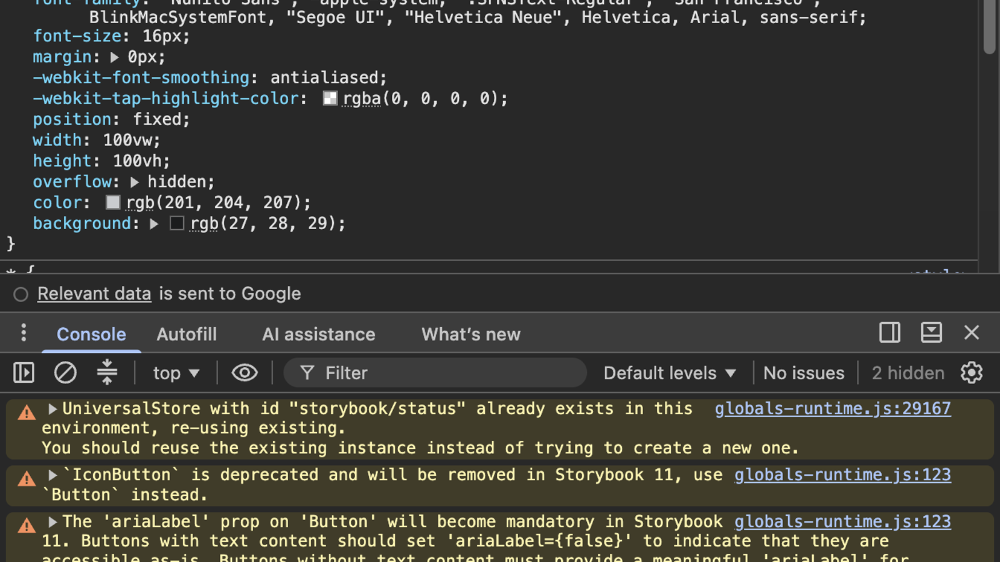
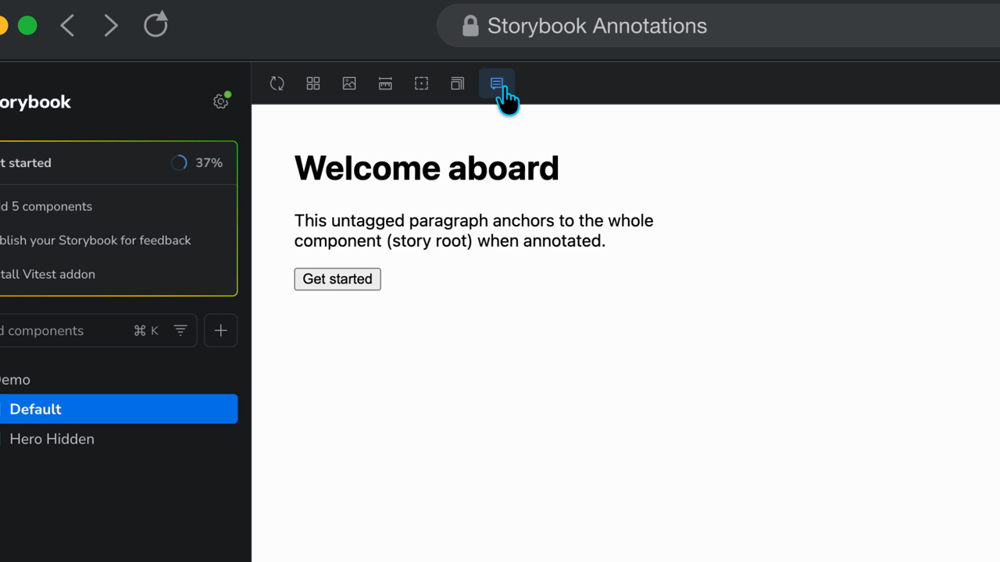
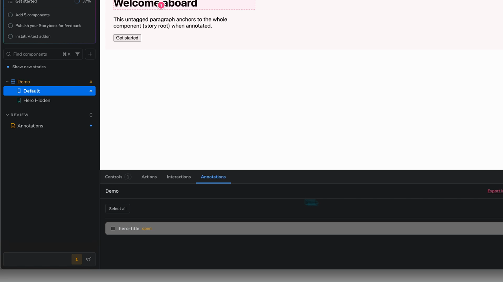
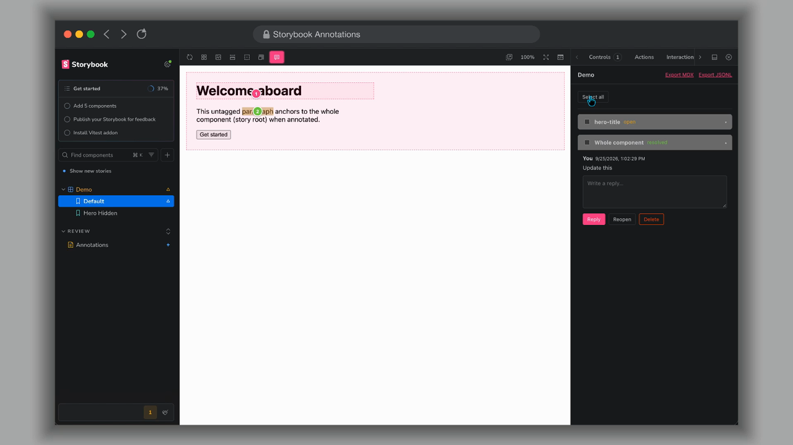

# Storybook Addon Annotations

Leave visual annotations and threaded review comments directly on the Storybook canvas. Each annotation is anchored to a Storybook story and either a tagged element or a text selection, while the thread is managed from the Storybook panel.

> **Status:** `0.1.2` published release.
>
> **Links:** [npm package](https://www.npmjs.com/package/@kylebrodeur/storybook-addon-annotations) · [GitHub repository](https://github.com/kylebrodeur/storybook-addon-annotations) · [issue tracker](https://github.com/kylebrodeur/storybook-addon-annotations/issues)

<video src="docs/media/storybook-annotations-demo.mp4" poster="docs/media/annotation-docs.png" controls muted loop playsinline width="100%"></video>

### In the Storybook canvas



### In the Annotations panel



### Review report



## Features

- Click the canvas to place a numbered annotation pin.
- Attach a pin to the nearest element marked with `data-annotation-anchor`.
- Select text to create a text-range annotation with a quote and normalized highlight rectangles.
- Reply to threads, resolve/reopen them, and delete them individually or in bulk from the Annotations panel.
- Keep annotations stable across responsive canvas sizes using normalized fractions rather than viewport pixels.
- Persist local development annotations as one JSON object per line.
- Export a story's annotations as JSON for review tooling or later migration.
- Use Storybook globals to toggle annotation mode from the toolbar.

## Install

Install the published package as a Storybook development dependency:

```bash
npm install --save-dev @kylebrodeur/storybook-addon-annotations
```

Then register it in `.storybook/main.ts`:

```ts
const config = {
  addons: ['@kylebrodeur/storybook-addon-annotations'],
};

export default config;
```

The addon automatically registers its manager panel, toolbar control, preview decorator, and local development server preset.

No CLI, no manual step. Installing the package is the setup: a `postinstall` hook registers the addon in `.storybook/main.*` when one exists — silent, additive, idempotent. It skips CI, workspaces without a Storybook config, and `STORYBOOK_ANNOTATIONS_SKIP_SETUP=1`, and it never guesses your store tracking: whether `.storybook-annotations.jsonl` is committed or ignored is the team's decision, asked by the first-run wizard (interactive installs) and the in-app setup dialog.

If installation was skipped (scripts blocked, pnpm allowlist, `--ignore-scripts`), register the addon manually as shown above; the same manual step is the documented fallback.

If the registration changes `.storybook/main.*`, restart Storybook manually so the new configuration is loaded. The addon intentionally does not attempt to restart its parent Storybook process.

When the Annotations panel is open, its first-run card separates these actions:

- **Set up annotations** — opens a native dialog to choose store tracking and, on a story, generate its Docs report page. The report appears in the Storybook index without a restart.
- **Start annotating** — enables annotation mode for the current story immediately.
- **Not now** — dismisses onboarding without changing setup or runtime state.

Setup skips the Docs report, and says why, when:

- the current view is not a story, so there is no story to report on;
- the `stories` glob would not index an `.mdx` file, which would leave an orphan page;
- another Docs page already uses the report title — Storybook fails the entire index when two pages share a title, so setup refuses to create that conflict;
- the report already exists — it is left untouched rather than overwritten.

## Mark stable anchors

Tag important component or element boundaries with a stable key:

```tsx
export function ProductCard() {
  return (
    <article data-annotation-anchor="product-card">
      <h2 data-annotation-anchor="product-card-title">Product card</h2>
      <button data-annotation-anchor="product-card-action">Buy now</button>
    </article>
  );
}
```

If no tagged ancestor is found, the annotation is attached to the story root. Anchor keys should be deterministic and should not contain generated React IDs.

## Story parameters

The addon accepts the following story or global parameters:

```ts
export default {
  parameters: {
    annotations: {
      disable: false,
      currentUser: 'Kyle',
    },
  },
};
```

- `disable: true` disables annotation behavior for the story.
- `currentUser` supplies the display name for messages created in the panel.

## Local persistence

The preset stores local threads in `.storybook-annotations.jsonl` by default. The file is intentionally a development artifact and should not be committed. Override the location through the preset options when needed:

```ts
addons: [
  {
    name: '@kylebrodeur/storybook-addon-annotations',
    options: {
      storeFile: '.tmp/storybook-review.jsonl',
    },
  },
];
```

## Docs report

The setup dialog in the Annotations panel generates the Docs report for the story you are viewing, written to `src/storybook/annotations.mdx`. A new `.mdx` page is indexed by a running Storybook without a restart; only a `.storybook/main.*` change needs one. Docs reports remain consumer-owned and the Annotations Docs block is read-only.

## Development

Run the addon Storybook locally:

```bash
pnpm install
pnpm start
```

Release validation:

```bash
pnpm test
pnpm typecheck
pnpm lint
pnpm lint:anti-slop
pnpm build
pnpm build-storybook
npm pack --dry-run
```

The complete release checklist is in [`docs/release-checklist.md`](docs/release-checklist.md).

## Agent skills

Reusable agent skills ship in [`skills/`](skills/):

- [`skills/storybook-addon-annotations/SKILL.md`](skills/storybook-addon-annotations/SKILL.md) — install, register, anchor, review, and verify the addon.
- [`skills/storybook-addon-annotations-release/SKILL.md`](skills/storybook-addon-annotations-release/SKILL.md) — release gates, npm publication, GitHub release, and consumer install.

Agents should read the install/interaction skill before touching a consumer Storybook, and follow the release skill for any publish or version install.

## Package layout

- `dist/manager.js` — Storybook manager panel and toolbar bundle.
- `dist/preview.js` — preview decorator and canvas overlay bundle.
- `dist/blocks.js` — Docs blocks for annotation summaries and reveal actions.
- `dist/preset.js` — local server and Storybook preset integration.
- `dist/index.js` — public decorator/utility exports.
- `skills/` — agent skills for installation, interaction, and release.
- `scripts/` — postinstall setup, interactive welcome wizard, and prepublish checks.

## License

MIT © Kyle Brodeur and contributors.
